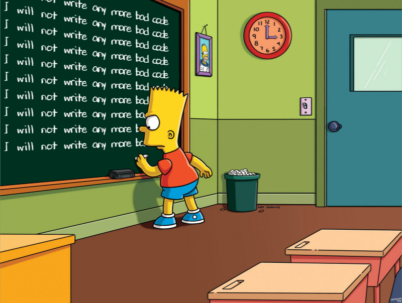
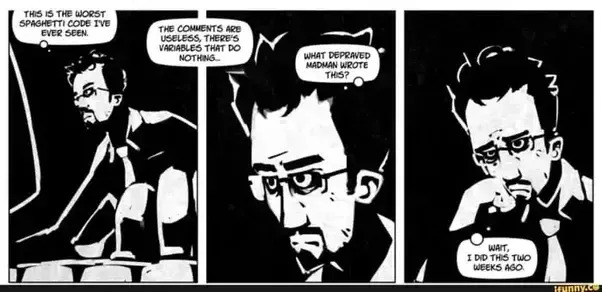
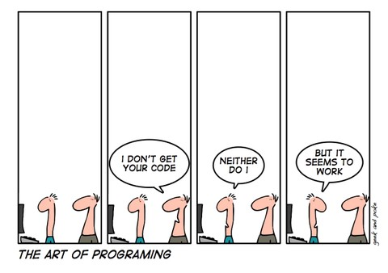
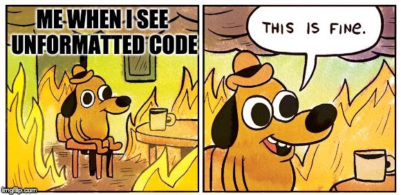
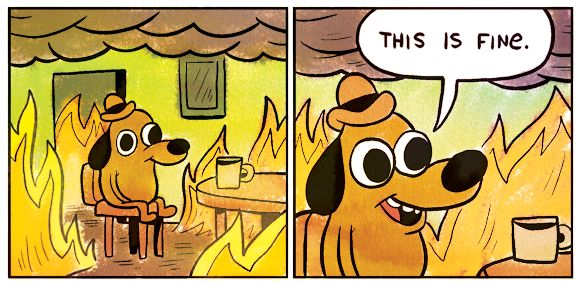
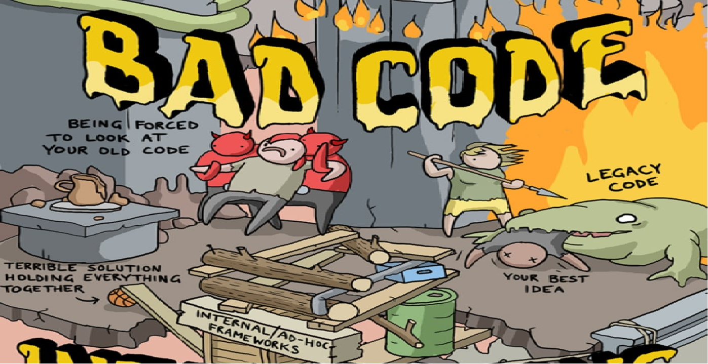

```{r setup, include=FALSE}
options(htmltools.dir.version = FALSE)
```


<div style="text-align: center">
  
</div>


---
class: inverse, center, middle

# Motivations

---
class: center, middle

<div style="text-align: center">
  <p>
    <em>"Code is read more often than it is written."</em>
  </p>
  <p>
    -- Guido van Rossum
  </p>
</div>

---

# Motivation

During our coder/developer journey, we have all had to: 

* Contribute to or take over someone else's code
* Review or QA a collaborator's code
* Read our own code ...

<div style="text-align: center">
  
</div>

---

# Motivation

Programming is not that far from authoring an essay, a book, a thesis, or a report. Developers, just like writers, have:

* Personal styles, patterns and quirks
* Characteristic skillsets (including domain specific ones)
* Personal views
* Differing strategies (a.k.a. "There is more than one way to skin a cat.")

<div style="text-align: center">
  
</div>

---

# Motivation

Everything in your house has a designated place for it. The stove goes in the kitchen and you would not put it in your bedroom, would you?

<div style="text-align: center">
  
</div>

---

# In Summary, best practices ...

--

<br/>
<br/>
<br/>

> * Facilitate collaboration and enhance code maintanability.

--

> * Reduce the cognitive effort resulting from structural disparities. Instead, it places a special focus on the narrative (and logic).

--

> * Ease up your workload by acting as a boilerplate (blue print): you can focus on the code's logic instead.

---
class: center, middle

# Best practices ...

<div style="font-size: 20px;">
  <blockquote>
  <p>
    Are not just some boring rules!
  </p>
  
--

  <p>
    Have been built by coders, teams, geeks, nerds, designers ... to make our lives easier and to make us better team players.
  </p>
  
--
  
  <p>
    Lead to enhanced productivity, collaboration, and even happiness within teams.
  </p>
  
  </blockquote>
</div>

---
class: inverse, center, middle

# Naming

---

# Did you say "naming"?

<div style="text-align: center;">
  
</div>

---

# Did you say "naming"?

<div style="text-align: center; padding-top: 130px;">
  <p>
    <em>"There are only two hard things in Computer Science: cache invalidation and naming things."</em>
  </p>
  <p>
    -- Phil Karlton
  </p>
</div>
<br>


---

# Good Vs Bad

.pull-left[
Does what it says on the tin:

```r
*query_google_places <- function(url) {
  pre_process_url(url) %>%
    fromJSON()
}
```

Concise:
```r
*json_to_csv <- function(fname) {
  fromJSON(fname) %>%
    write_csv("./foo.csv")
}
```

Consistent:
```r
*trim_whitespaces <- function(string) {
  # DO STUFF
}

*filter_pattern <- function(string, pattern) {
  # DO STUFF
}
```
]

.pull-right[
YOLO!:

```r
*get_data <- function(url) {
  pre_process_url(url) %>%
    fromJSON()
}
```

Stutter:
```r
*fct_convert_json_to_csv <- function(fname) {
  fromJSON(fname) %>%
    write_csv("./foo.csv")
}
```

YOLO!:
```
*trimWhiteSpaces <- function(input) {
  # DO STUFF
}

*FSA_filter <- function(string1, string2) {
  # DO STUFF
}
```
]

> See [The tidyverse style guide](http://adv-r.had.co.nz/Style.html), by Hadley Wickham.

---

# Naming on steroids

```{css, echo=FALSE}
.remark-code {
  display: block;
  overflow-x: auto;
  padding: .5em;
  color: #333;
  background: #f8f8f8;
  font-size: 12px;
}
```

```{elixir}
defmodule Identicon.image do

  def hash_string(input) do
    hex = :crypto.hash(:md5, input)
          |> :binary.bin_to_list
    
    %Identicon.Image{hex: hex}
  end
  
  def pick_color(%Identicon.Image{hex: [r, g, b | _tail]} = image) do
    %Identicon.Image(image | color: {r, g, b})
  end
  
  # DO MORE STUFF ...
  
  def main(input) do
    input
    |> hash_string
    |> pick_color
    |> build_grid
    |> filter_odd_square
    |> build_pixel_map
    |> draw_image
    |> save_image
  end
end
```

--

> Good naming can become an abstraction layer to a code base. It makes both the code and its logic easily understandable by anyone.

---

# Not good enough though ...

<div style="text-align: center;">
  
</div>

---

# Documenting

.pull-left[
Good
```r
#' Replace patterns in a string (use regex).
#'
#' @param string A character vector.
#' @param from A string containing the patterns ...
#' @param to A string vector of the replacements (element-wise) for `from`.
#' @return A character vector.
#' @examples
#' string <- "Here, is a string: this is a test one."
#' from <- c("H.*,", ":", "\\.")
#' to <- c("", "", "")
#' replace_in_string(string, from, to)
#'
#' @importFrom stringi stri_replace_all_regex
#' @importFrom stringr str_squish
#' @importFrom purrr when
replace_in_string <- function(string, from, to) {
  stri_replace_all_regex(
    string,
    pattern = from,
    replacement = to,
    vectorize_all = FALSE
  ) %>%
    when(squish_ws ~ str_squish(.),
         ~.
    )
}
```
]

.pull-right[
Poor ... Bad
```r
# function to replace a pattern in a string
replace_in_string <- function(string, p1, p2) {
  # replace regex
  stri_replace_all_regex(
    string,
    p1,
    p2,
    vectorize_all = FALSE
  ) %>%
    when(squish_ws ~ str_squish(.),
         ~.
    )
}
```
Issues:
* stutter
* unclear naming
* mixes positional and named parameters
* no imports and no context
* no example
]

---

# Documentation ...

--

<br/>
<br/>

> * Supports your code, enhances debug and maintainability.

--

> * Facilitates code sharing.

--

> * Helps you remember the logic you wanted to implement.

--

> * Improves testing (`@example` in R or `doctest` in Python).

--

> * Is a pre-requisite to building packages.

---

# Style, formatting and identation


<div style="text-align: center;">
  
</div>

---

# Style, formatting and identation

```python
output = google_places[["postcode", "address", "candidates"]][google_places["candidates"] == 1].drop_duplicates().groupby("postcode").size().reset_index().compute()
```

--

"Let there exist some natural number $x > 5$, and an automorphism $f$ ... then there exist such number ..."

<div style="text-align: center;">
  
</div>

---

# Style, formatting and identation

```python
output = google_places[["postcode", "address", "candidates"]][google_places["candidates"] == 1].drop_duplicates().groupby("postcode").size().reset_index().compute()
```
--

```python
# Python: create a code block with parenthesis to indent and split lines
output = (
    google_places[["postcode", "address", "candidates"]][
        google_places["candidates"] == 1
    ]
    .drop_duplicates()
    .groupby("postcode")
    .size()
    .reset_index()
    .compute()
)
```

--

<div style="text-align: center;">
  
</div>

---

# Style, formatting and identation

--

<br/>
<br/>

> * Easier to read = easier to understand.

--

> * Easier to read = easier to debug (closures in particular).

--

> * Easy formatting: <kbd>Ctrl</kbd> + <code>⇧</code> + <kbd>A</kbd> (RStudio).

--

> * Use [`styler`](https://www.tidyverse.org/blog/2017/12/styler-1.0.0/) (R), [`black`](https://black.readthedocs.io/en/stable/) (Python).

--

> * There is one for every language, e.g. [`Prettier`](https://prettier.io/) covers HTML, SCSS, JSX, Elm, PHP, Ruby, Java, Javascript, ...

--

<br/>
<div style="background-color: pink; padding: 10px 10px 10px 10px;">
  <p>
    Use formatting tools and/or keyboard shortcuts!
  </p>
</div>

---

# Consistency

<br/>

```r
library(xml2)

#Function to get DEFRA data
DEFRA_get <- function(URL_DEFRA){
  # Function to download DEFRA data from XML URL string input
  URL <- URL_DEFRA
  res <- read_xml(URL)
  res <- xml2::xml_child(res, 2)
  res <- XML::xmlParse(res)
  
  # extract establishment data
  est <- res %>%
    XML::getNodeSet("//establishment") %>%
    XML::xmlToDataFrame()

  res2 <- xmlToDataFrame(res)
  res3 <- cbind(est, res2)

  res <- res3
  res[["establishment"]] <- gsub("[0-9]", "", res$establishment)
  res$URL <- URL_DEFRA
  
  return(res)
}
```

---

# Consistency

<div style="text-align: center;">
  
</div>

---

# Consistency

```r
library(xml2)                                                    # import xml2 but not XML

#Function to get DEFRA data                                      # stutter
DEFRA_get <- function(URL_DEFRA){                                # poor naming
  # Function to download DEFRA data from XML URL string input    # stutter
  URL <- URL_DEFRA                                               # unnecessary reassignment 
  res <- read_xml(URL)
  res <- xml2::xml_child(res, 2)                                 # unnecessary reassignment 
  res <- XML::xmlParse(res)                                      # could use xml2
  
  # extract establishment data
  est <- res %>%                                                 # use pipes + assignment
    XML::getNodeSet("//establishment") %>%
    XML::xmlToDataFrame()

  res2 <- xmlToDataFrame(res)                                    # unnecessary reassignment 
  res3 <- cbind(est, res2)                                       # unnecessary reassignment 

  res <- res3                                                    # unnecessary reassignment 
  res[["establishment"]] <- gsub("[0-9]", "", res$establishment) # mix `[[` and `$`
  res$URL <- URL_DEFRA                                           # mix `[[` and `$`
  
  return(res)                                                    # redundant return
}
```

> * In R, `::`accesses a function exported by a specific package.
> * Avoid importing the full library, use `::` or `import::from()`.
> * Be consistent with accessors (`[`, `[[`, `$`).

---

# Consistency

```r
import::from(magrittr, "%>%")                          # only import what is necessary ...
import::from(xml2, read_xml, xml_child, xml_find_all)  # ... and avoid shadowing
import::from(dplyr, mutate_at)

#' Download data source and ...                        # documentation !!
#'
#' @param url ...
#' @return a list ...
xml_to_dataframe <- function(url, src = "DEFRA"){      # modular and re-usable
  res <- list()

  res$data <- read_xml(url) %>%
    xml_child(2) %>%
    xml_find_all("//establishment") %>%
    as.data.frame() %>%
    mutate_at(
      "establishment",
       ~ gsub("[0-9]", "", .x)
    )
  
  res$url <- url

  res
}
```

> * Only import the necessary libraries and avoid shadowing.
> * Top level imports and documentation.
> * Modular and reusable (can be used for more than DEFRA).
> * Consistent use of pipes, no unnecessary reassignment, shorter.

---

# Clarity, modularity and efficiency

```r
urls <- c(
  "https://maps.googleapis.com/maps/api/postcode='EC2A 0RN'",
  "https://maps.googleapis.com/maps/api/postcode='E8 3PE'",
  "https://maps.googleapis.com/maps/api/postcode='BN1 2RD'"
)

for (i in 1:length(urls)) {                                     # not modular
  res <- c()
  res[i] <- url %>%
    fromJSON() %>%
    unlist() %>%
    as.list() %>%
    as_tibble()
}

tbl <- tibble()                                                 # DRY

for (i in 1:length(res)) {                                      # DRY
  tbl <- bind_rows(                                             # grow and copy
    tbl,
    res[i]
  )
}
```

> * `for` loops are hard to read and memory inefficient.
> * Not modular `->` hard to test and debug.
> * Do Not Repeat Yourself (DRY principle).

---

# Clarity, modularity and efficiency

### Functions, a quick reminder

> * Self contained pieces of code that encapsulate a specific task.
> * Take an input (e.g. data) and/or parameters and return an output.
> * Can be called multiple times in the code (instead of rewriting).
> * Split program is sub pieces of code (modularity).
> * Isolates code and keep namespace clean.
> * Facilitate testing.

--

```r
# Declare a function in R
hello_me <- function(my_name) {
  print(
    paste0("Hello ", string, "!")
  )
}

# Declare a function in Python
def hello_me(my_name):
    print("Hello " + my_name + "!")
    

# output
hello_me("Xavier")
> "Hello Xavier!"
```

---

# Clarity, modularity and efficiency

```r
urls <- c(
  "https://maps.googleapis.com/maps/api/postcode='EC2A 0RN'",
  "https://maps.googleapis.com/maps/api/postcode='E8 3PE'",
  "https://maps.googleapis.com/maps/api/postcode='BN1 2RD'"
)

get_google_nearby_search <- function(url) {                      # modular + test ready 
  url %>%
    fromJSON() %>%
    unlist() %>%
    as.list()
}

places <-
  apply(
    urls,
    get_google_nearby_search
  ) %>%
  as_tibble()                                                    # single vectorized operation
```

> * `apply()` makes code clearer and shorter.
> * `apply()` indicates the output's data structure (e.g. `lapply()`).
> * No growing of data structures `->` no memory clutter `->` faster.

--

<div style="background-color: pink; padding: 10px 10px 10px 10px;">
  <p>
    In coding: clarity, modularity and efficiency often go hand in hand.
  </p>
</div>

---

# Clarity, modularity and efficiency

--

> * Think "vectorized" and favor vectorized operations.

--

> * Think "modularity" `->` "reusability".

--

> * Avoid growing data structures - it makes copies and clutters memory.

--

> * Functions and modularity `->` easy testing (input `->` output).

--

> * Most programming languages have `map`, `filter`, `reduce`, `apply` ... they have been designed to write faster, maintainable and reproducible code (one given input always produces the same output).

--

<div style="background-color: LightGrey; padding: 10px 10px 10px 10px;">
  <p>
    <code>lapply()</code/>: apply a function to every element of a list and returns a list.
  </p>
  <p>
    <code>sapply()</code/> works like <code>lapply()</code>, but tries to simplify the output to the most elementary data structure that is possible.
  </p>
</div>


---

# Portability

.pull-left[
BAD
```python
import pandas as pd


# hard coded + not cross-platform
base_dir = "C:/Users/UserName/myproject/"
fname = "establishments.csv"

df <- pd.read_csv(
    base_dir + "data/" + fname
)
```
]

.pull-right[
GOOD
```python
from pathlib import Path
import pandas as pd


base_dir = Path(__file__).parent.absolute()
fname = "establishments.csv"

df <- pd.read_csv(
    base_dir / "data" / fname
)
```
]

--

<div style="background-color: pink; padding: 10px 10px 10px 10px;">
  <p>
    DO NOT - hard code or write code that requires other users to modify, comment or uncomment your code for it to work.
  </p>
</div>
<br/>
<div style="background-color: LightGreen; padding: 10px 10px 10px 10px;">
  <p>
    DO - use functions or methods that resolve <code>PATH</code> and support cross platform (<span>"&#92;"</span> on Windows and <span>"&#47;"</span> on Unix).
  </p>
</div>

---

# Testing

> * We all test our code during development, unfortunately, we rarely keep track of these little blobs of code that are actually unit tests.

> * Testing helps build maintainable and robust code, that does not break upon changes.

> * Basic testing (documentation):
>   * R - [`@example`](https://cran.r-project.org/web/packages/roxygen2/vignettes/rd.html)
>   * Python - [`doctest`](https://docs.python.org/3/library/doctest.html)

> * Testing frameworks/libraries
>   * R - [`testthat`](https://testthat.r-lib.org/)
>   * Python - [`unittest`](https://docs.python.org/3/library/unittest.html), [`pytest`](https://docs.pytest.org/en/6.2.x/), [`nose`](https://nose.readthedocs.io/en/latest/testing.html)

---

# Testing

```r
# R/address.R
format_postcode <- function(postcode, locale = "GBR") {
  switch(locale,
    "GBR" = {
      postcode_pattern <- "([A-Z]{1,2}\\d[A-Z\\d]?)(\\d[A-Z]{2})"
    }
  )

  postcode <- str_squish(postcode) %>%
    toupper()

  if (!grepl(" ", postcode, fixed = TRUE)) {
    gsub(postcode_pattern, "\\1 \\2", postcode, perl = TRUE)
  } else {
    postcode
  }

  case_when(
    !grepl(" ", postcode, fixed = TRUE) ~ gsub(postcode_pattern, "\\1 \\2", postcode, perl = TRUE),
    postcode == "NAN" ~ NA_character_,
    is.na(postcode) ~ NA_character_,
    TRUE ~ postcode
  )
}

# test/testthat/test-address.R
test_that("format postcodes", {
  expect_equal(format_postcode("EC3R0RN"), "EC3R 0RN")
  expect_equal(format_postcode("  EC28EE "), "EC2 8EE")
  expect_equal(format_postcode("N17RN  "), "N1 7RN")
  expect_equal(format_postcode("N17  "), "N17")
})
```

---

# More on good practices?


<div style="text-align: center; padding-top: 150px;">
  <p>
    Quality Assurance of Code for Analysis and Research
  </p>
  <a href=href="https://best-practice-and-impact.github.io/qa-of-code-guidance/intro.html">The Duck book</a>
</div>
<br>

---

# What you are Walking away from ...

<div style="text-align: center">
  
</div>


