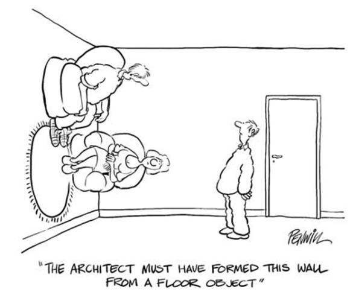

```{r setup, include=FALSE}
options(htmltools.dir.version = FALSE)
```


<div style="text-align: center">
  
</div>


---
class: inverse, center, middle

# Motivations

---
class: center, middle

<div style="text-align: center">
  <p>
    <em>"Code is read more often than it is written."</em>
  </p>
  <p>
    -- Guido van Rossum
  </p>
</div>

---

# Motivation

During our coder/developer journey, we have all had to: 

* Contribute to or take over someone else's code
* Review or QA a collaborator's code
* Read our own code ...

<div style="text-align: center">
  
</div>

---

# Motivation

Programming is not that far from authoring an essay, a book, a thesis, or a report. Developers, just like writers, have:

* Personal styles, patterns and quirks
* Characteristic skillsets (including domain specific ones)
* Personal views
* Differing strategies (a.k.a. "There is more than one way to skin a cat.")

<div style="text-align: center">
  
</div>

---

# Motivation

Everything in your house has a designated place for it. The stove goes in the kitchen and you would not put it in your bedroom, would you?

<div style="text-align: center">
  
</div>

---

# In Summary, best practices ...

--

<br/>
<br/>
<br/>

> * Facilitate collaboration and enhance code maintanability.

--

> * Reduce the cognitive effort resulting from structural disparities. Instead, it places a special focus on the narrative (and logic).

--

> * Ease up your workload by acting as a boilerplate (blue print): you can focus on the code's logic instead.

---
class: center, middle

# Best practices ...

<div style="font-size: 20px;">
  <blockquote>
  <p>
    Are not just some boring rules!
  </p>
  
--

  <p>
    Have been built by coders, teams, geeks, nerds, designers ... to make our lives easier and to make us better team players.
  </p>
  
--
  
  <p>
    Lead to enhanced productivity, collaboration, and even happiness within teams.
  </p>
  
  </blockquote>
</div>

---
class: inverse, center, middle

# Naming

---

# Did you say "naming"?

<div style="text-align: center;">
  
</div>

---

# Did you say "naming"?

<div style="text-align: center; padding-top: 130px;">
  <p>
    <em>"There are only two hard things in Computer Science: cache invalidation and naming things."</em>
  </p>
  <p>
    -- Phil Karlton
  </p>
</div>
<br>


---

# Good Vs Bad

.pull-left[
Does what it says on the tin:

```r
*query_google_places <- function(url) {
  pre_process_url(url) %>%
    fromJSON()
}
```

Concise:
```r
*json_to_csv <- function(fname) {
  fromJSON(fname) %>%
    write_csv("./foo.csv")
}
```

Consistent:
```r
*trim_whitespaces <- function(string) {
  # DO STUFF
}

*filter_pattern <- function(string, pattern) {
  # DO STUFF
}
```
]

.pull-right[
YOLO!:

```r
*get_data <- function(url) {
  pre_process_url(url) %>%
    fromJSON()
}
```

Stutter:
```r
*fct_convert_json_to_csv <- function(fname) {
  fromJSON(fname) %>%
    write_csv("./foo.csv")
}
```

YOLO!:
```
*trimWhiteSpaces <- function(input) {
  # DO STUFF
}

*FSA_filter <- function(string1, string2) {
  # DO STUFF
}
```
]

> See [The tidyverse style guide](http://adv-r.had.co.nz/Style.html), by Hadley Wickham.

---

# Naming on steroids

```{css, echo=FALSE}
.remark-code {
  display: block;
  overflow-x: auto;
  padding: .5em;
  color: #333;
  background: #f8f8f8;
  font-size: 12px;
}
```

```{elixir}
defmodule Identicon.image do

  def hash_string(input) do
    hex = :crypto.hash(:md5, input)
          |> :binary.bin_to_list
    
    %Identicon.Image{hex: hex}
  end
  
  def pick_color(%Identicon.Image{hex: [r, g, b | _tail]} = image) do
    %Identicon.Image(image | color: {r, g, b})
  end
  
  # DO MORE STUFF ...
  
  def main(input) do
    input
    |> hash_string
    |> pick_color
    |> build_grid
    |> filter_odd_square
    |> build_pixel_map
    |> draw_image
    |> save_image
  end
end
```

--

> Good naming can become an abstraction layer to a code base. It makes both the code and its logic easily understandable by anyone.

---

# Not good enough though ...

<div style="text-align: center;">
  
</div>

---

# Documenting

.pull-left[
Good
```r
#' Replace patterns in a string (use regex).
#'
#' @param string A character vector.
#' @param from A string containing the patterns ...
#' @param to A string vector of the replacements (element-wise) for `from`.
#' @return A character vector.
#' @examples
#' string <- "Here, is a string: this is a test one."
#' from <- c("H.*,", ":", "\\.")
#' to <- c("", "", "")
#' replace_in_string(string, from, to)
#'
#' @importFrom stringi stri_replace_all_regex
#' @importFrom stringr str_squish
#' @importFrom purrr when
replace_in_string <- function(string, from, to) {
  stri_replace_all_regex(
    string,
    pattern = from,
    replacement = to,
    vectorize_all = FALSE
  ) %>%
    when(squish_ws ~ str_squish(.),
         ~.
    )
}
```
]

.pull-right[
Poor ... Bad
```r
# function to replace a pattern in a string
replace_in_string <- function(string, p1, p2) {
  # replace regex
  stri_replace_all_regex(
    string,
    p1,
    p2,
    vectorize_all = FALSE
  ) %>%
    when(squish_ws ~ str_squish(.),
         ~.
    )
}
```
* stutter
* unclear naming
* mix positional and named parameters
* no imports and no context
* no example
]

---

# Documentation ...

--

<br/>
<br/>

> * Supports your code, enhances debug and maintainability

--

> * Facilitates code sharing

--

> * Helps you remember

--

> * Improves testing (`@example` in R or `doctest` in Python)

--

> * Is a pre-requisite to building packages

---

# Style, formatting and identation


<div style="text-align: center;">
  
</div>

---

# Style, formatting and identation

```python
output = google_places[["postcode", "address", "candidates"]][google_places["candidates"] == 1].drop_duplicates().groupby("postcode").size().reset_index().compute()
```

--

"Let there exist some natural number $x > 5$, and an automorphism $f$ ... then there exist such number ..."

<div style="text-align: center;">
  
</div>

---

# Style, formatting and identation

```python
output = google_places[["postcode", "address", "candidates"]][google_places["candidates"] == 1].drop_duplicates().groupby("postcode").size().reset_index().compute()
```
--

```python
output = (
    google_places[["postcode", "address", "candidates"]][
        google_places["candidates"] == 1
    ]
    .drop_duplicates()
    .groupby("postcode")
    .size()
    .reset_index()
    .compute()
)
```

--

<div style="text-align: center;">
  
</div>

---

# Style, formatting and identation

--

<br/>
<br/>

> * Easier to read = easier to understand

--

> * Easier to read = easier to debug (closures in particular)

--

> * Easy (pre) formatting: <kbd>Ctrl</kbd> + <code>⇧</code> + <kbd>A</kbd> (RStudio)

--

> * Use [`styler`](https://www.tidyverse.org/blog/2017/12/styler-1.0.0/) (R), [`black`](https://black.readthedocs.io/en/stable/) (python)

--

> * There is one for every language, e.g. [`Prettier`](https://prettier.io/) covers HTML, SCSS, JSX, Elm, PHP, Ruby, Java, Javascript, ...

---

# Consistency

<br/>

```r
library(xml2)

#Function to get DEFRA data
DEFRA_get <- function(URL_DEFRA){
  # Function to download DEFRA data from XML URL string input
  URL <- URL_DEFRA
  res <- read_xml(URL)
  res <- xml2::xml_child(res, 2)
  res <- XML::xmlParse(res)
  
  # extract establishment data
  est <- res %>%
    XML::getNodeSet("//establishement") %>%
    XML::xmlToDataFrame()

  res2 <- xmlToDataFrame(res)
  res3 <- cbind(est, res2)

  res <- res3
  res[["establishment"]] <- gsub("[0-9]", "", res$establishment)
  res$URL <- URL_DEFRA
  
  return(res)
}
```

---

# Consistency

<div style="text-align: center;">
  
</div>

---

# Coding efficiency

* DRY
